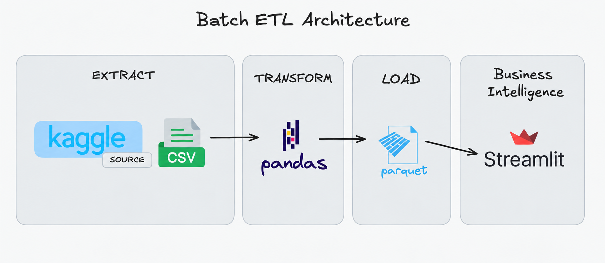
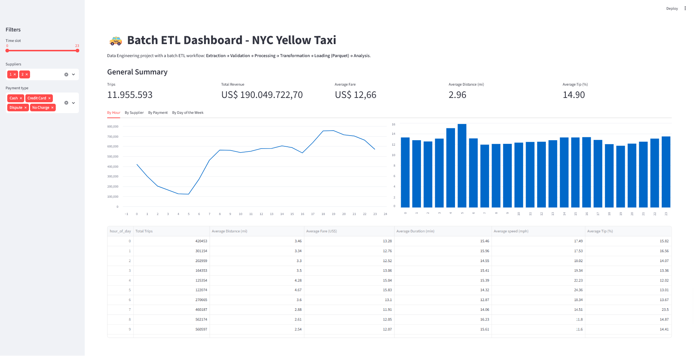
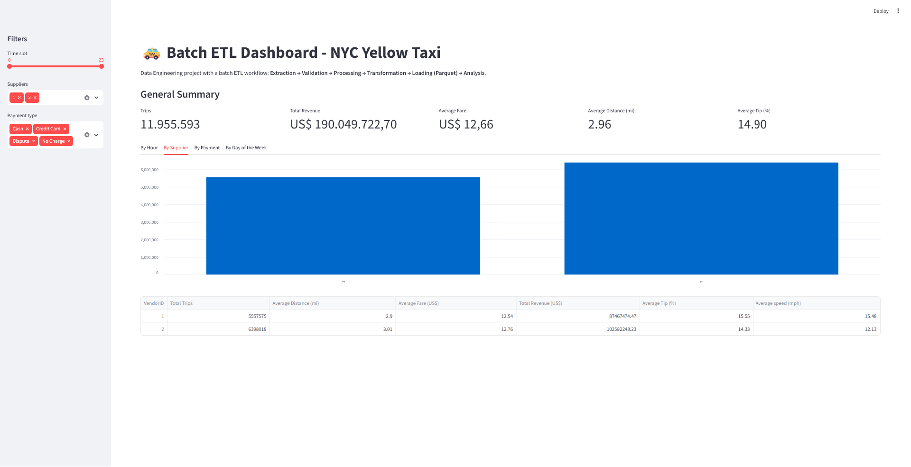
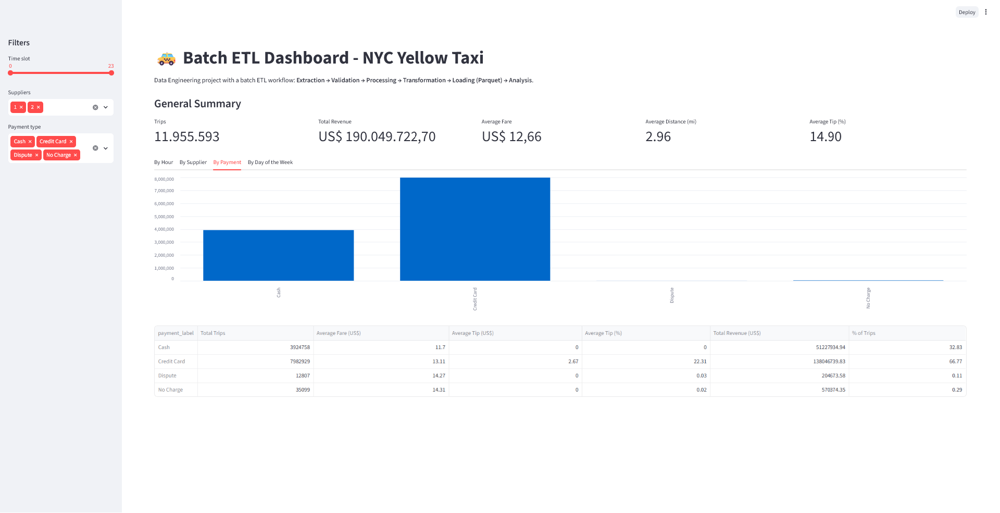
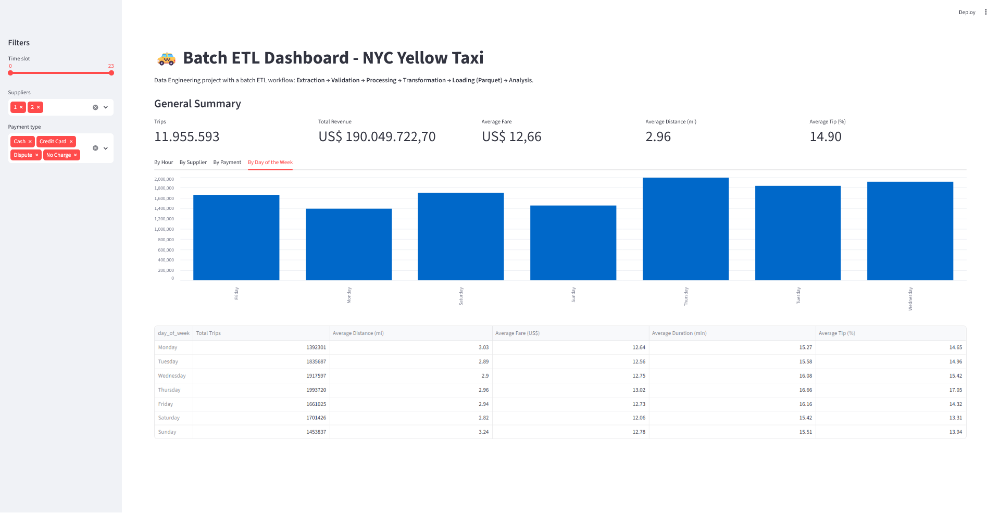

# Batch ETL Pipeline - NYC Yellow Taxi
### 🚕 Data engineering project featuring a batch ETL pipeline for NYC taxi trip data, Parquet storage, and an interactive Streamlit dashboard.

---

## About the Project
This repository demonstrates a complete batch ETL workflow using real NYC Yellow Taxi data.

The pipeline covers the following stages:

1. CSV data extraction
2. Data validation and quality handling
3. Transformation and metric creation
4. Aggregations for analysis
5. Persistence in Parquet format
6. Visualization in Streamlit
___

## Pipeline Architecture

___

## Dashboard
### Overview

___
### Analysis by Supplier

___
### Analysis by Payment

___
### Analysis by Day of the Week

___
## Stack
| Layer | Technology | Version | Why we use it |
| :--- | :--- | :--- | :--- |
| Core | Python | 3.14+ | Main language to build the ETL and the dashboard. |
| Core | Streamlit | 1.44+ | Creates interactive dashboards quickly, without needing front-end. |
| Python Library | pandas | 2.2+ | Performs data cleaning, transformation, aggregations, and tabular analysis. |
| Python Library | pyarrow | 19.0+ | Reads and writes Parquet with good performance in columnar format. |
| Python Library | ipykernel | 7.2+ | Connects the Python environment to Jupyter Notebook. |
| Tool | Jupyter Notebook | - | Step-by-step development and validation of the ETL pipeline. |
| Tool | UV | - | Manages dependencies and project execution quickly and reproducibly. |
___
## Structure
```text
├── data/
│   ├── yellow_tripdata_2016-03.csv
│   └── output/
│       └── yellow_taxi_2016-03.parquet
├── notebooks/
│   └── main.ipynb
├── dashboard.py
```
___
## How to Run
### 1: Run the pipeline on the notebook
```text
uv run jupyter notebook
```
### 2: Run the Streamlit dashboard
```text
uv run streamlit run dashboard.py
```
___
